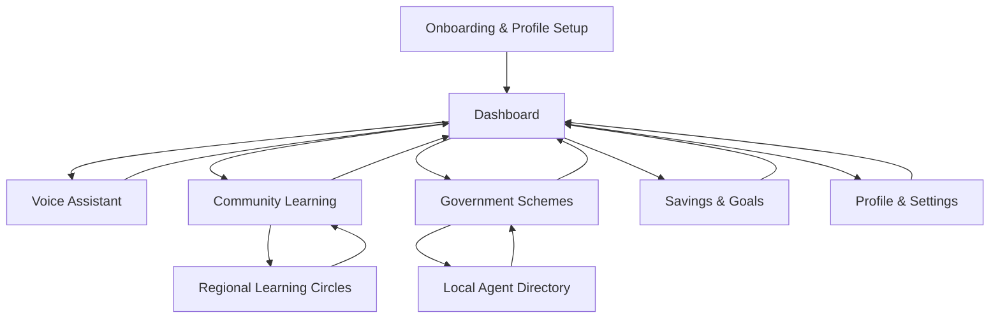

# FinTwin+ - Cultural & State-Aware Financial Application

## 1. Product Overview

FinTwin+ is a culturally-aware digital financial twin application that provides hyper-personalized financial mentorship through multilingual voice interaction, understanding users' cultural background, state-wise financial behavior, and aspirational goals.

The application addresses the financial literacy gap in rural and semi-urban India by combining AI-powered personalization with community-driven learning, making financial planning accessible through voice-first interaction in 15+ Indian languages.

Target market: 500+ million underserved Indians seeking culturally-relevant financial guidance with potential to capture significant market share in the growing fintech sector.

## 2. Core Features

### 2.1 User Roles

| Role             | Registration Method                                              | Core Permissions                                                                         |
| ---------------- | ---------------------------------------------------------------- | ---------------------------------------------------------------------------------------- |
| Regular User     | Mobile/Email registration with cultural profile setup            | Access to personal financial twin, voice guidance, community circles, government schemes |
| Community Mentor | Invitation-based upgrade after demonstrating financial knowledge | Can create learning content, lead peer circles, moderate discussions                     |
| Local Agent      | Verification-based registration with location proof              | Can assist users offline, provide scheme guidance, handle WhatsApp support               |

### 2.2 Feature Module

Our FinTwin+ application consists of the following main pages:

1. **Onboarding & Profile Setup**: Cultural profiling, state selection, language preference, voice-led goal setting
2. **Dashboard**: Personalized financial twin overview, cultural nudges, festival savings tracker, growth score
3. **Voice Assistant**: Multilingual voice navigation, TTS/STT interface, conversational financial guidance
4. **Community Learning**: Regional learning circles, story-based lessons, peer challenges, mentor interactions
5. **Government Schemes**: Eligibility checker, scheme recommendations, local agent directory, application assistance
6. **Savings & Goals**: Culture-aware goal setting, festival savings pots, investment filters, progress tracking
7. **Profile & Settings**: User preferences, language settings, cultural parameters, authentication management

### 2.3 Page Details

| Page Name                  | Module Name                  | Feature description                                                                                                                          |
| -------------------------- | ---------------------------- | -------------------------------------------------------------------------------------------------------------------------------------------- |
| Onboarding & Profile Setup | Cultural Profiling           | Capture user's state, religion, cultural practices, family structure, income sources, and financial goals through voice-guided questionnaire |
| Onboarding & Profile Setup | Voice-Led Goal Setting       | Allow users to set financial goals in their preferred language using voice commands with AI-powered goal categorization                      |
| Dashboard                  | Financial Twin Overview      | Display personalized financial health score, spending patterns, savings progress with cultural context and visual representations            |
| Dashboard                  | Cultural Nudges Engine       | Provide timely financial advice based on festivals, harvest seasons, wedding planning, and cultural events specific to user's region         |
| Dashboard                  | Growth Score Tracker         | Show gamified financial progress with rewards like talk-time recharges, insurance discounts, and community benefits                          |
| Voice Assistant            | Multilingual Voice Interface | Support 15+ Indian languages with natural language processing for financial queries and navigation                                           |
| Voice Assistant            | TTS/STT Integration          | Convert text to speech and speech to text for low-literate users with accent recognition and regional dialect support                        |
| Voice Assistant            | Conversational AI            | Provide contextual financial advice through natural conversation with cultural awareness and personalized responses                          |
| Community Learning         | Regional Learning Circles    | Create state/region-specific groups for peer learning with moderated discussions and expert guidance                                         |
| Community Learning         | Story-Based Micro-Lessons    | Share real success stories from similar cultural backgrounds with interactive learning modules and progress tracking                         |
| Community Learning         | Peer Challenges              | Organize community-driven savings challenges with leaderboards, group goals, and social motivation features                                  |
| Government Schemes         | Eligibility Checker          | Pre-filled forms for schemes like PMJJBY, Sukanya Samriddhi Yojana with automatic eligibility assessment                                     |
| Government Schemes         | Local Agent Network          | Directory of verified local agents with contact details, ratings, and availability for offline assistance                                    |
| Government Schemes         | WhatsApp Integration         | Offline mode support through WhatsApp bot for scheme information and basic guidance                                                          |
| Savings & Goals            | Festival Savings Planner     | Create dedicated savings pots for Diwali, weddings, harvest celebrations with automated contributions                                        |
| Savings & Goals            | Investment Filters           | Religiously compliant investment options including Shariah-compliant and Jain-ethical investment filters                                     |
| Savings & Goals            | Goal Tracking                | Visual progress tracking with cultural milestones and celebration features for achieved goals                                                |
| Profile & Settings         | Authentication Management    | JWT-based secure login with biometric support and multi-factor authentication options                                                        |
| Profile & Settings         | Language & Cultural Settings | Manage preferred languages, cultural parameters, notification preferences, and privacy settings                                              |

## 3. Core Process

**New User Flow:**
User downloads app → Voice-guided cultural profiling → Sets financial goals in native language → Joins relevant community circle → Receives personalized nudges → Tracks progress through gamified score

**Existing User Flow:**
User opens app → Views dashboard with cultural nudges → Interacts via voice for queries → Participates in community challenges → Checks government scheme eligibility → Updates goals and tracks progress

**Community Learning Flow:**
User joins regional circle → Accesses story-based lessons → Participates in peer challenges → Shares experiences → Mentors new members → Earns community recognition

## 4. User Interface Design

### 4.1 Design Style

* **Primary Colors**: Deep saffron (#FF9933) and India green (#138808) representing Indian cultural identity

* **Secondary Colors**: Warm gold (#FFD700) for prosperity themes and calming blue (#4A90E2) for trust

* **Button Style**: Rounded corners with subtle shadows, voice-activated buttons with pulsing animation

* **Typography**: Noto Sans for multilingual support, 16px base size for readability, larger fonts for elderly users

* **Layout Style**: Card-based design with cultural motifs, bottom navigation for mobile-first approach

* **Icons**: Hand-drawn style icons representing Indian cultural elements, voice wave animations, progress indicators

### 4.2 Page Design Overview

| Page Name                  | Module Name             | UI Elements                                                                                                          |
| -------------------------- | ----------------------- | -------------------------------------------------------------------------------------------------------------------- |
| Onboarding & Profile Setup | Cultural Profiling      | Step-by-step wizard with cultural imagery, voice recording buttons, progress indicators with traditional patterns    |
| Dashboard                  | Financial Twin Overview | Colorful cards with cultural icons, animated progress rings, festival countdown timers, growth score badge           |
| Voice Assistant            | Multilingual Interface  | Large microphone button with voice wave animation, language selector with flag icons, chat-like conversation bubbles |
| Community Learning         | Learning Circles        | Grid layout of regional groups with state emblems, story cards with user photos, challenge leaderboards              |
| Government Schemes         | Eligibility Checker     | Form-based layout with government logos, eligibility status indicators, agent contact cards with ratings             |
| Savings & Goals            | Festival Planner        | Calendar view with festival markers, savings pot visualizations, investment filter toggles with religious symbols    |
| Profile & Settings         | User Management         | Profile photo with cultural background, toggle switches for preferences, security settings with biometric icons      |

### 4.3 Responsiveness

The application is mobile-first with responsive design adapting to tablets and desktops. Touch interaction is optimized for voice commands, with large touch targets and gesture support. Progressive Web App (PWA) capabilities enable APK generation for Android devices while maintaining cross-platform compatibility.
